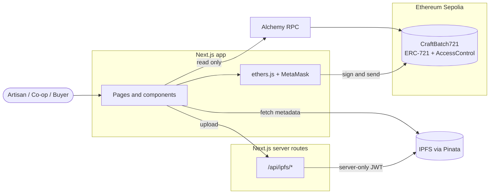
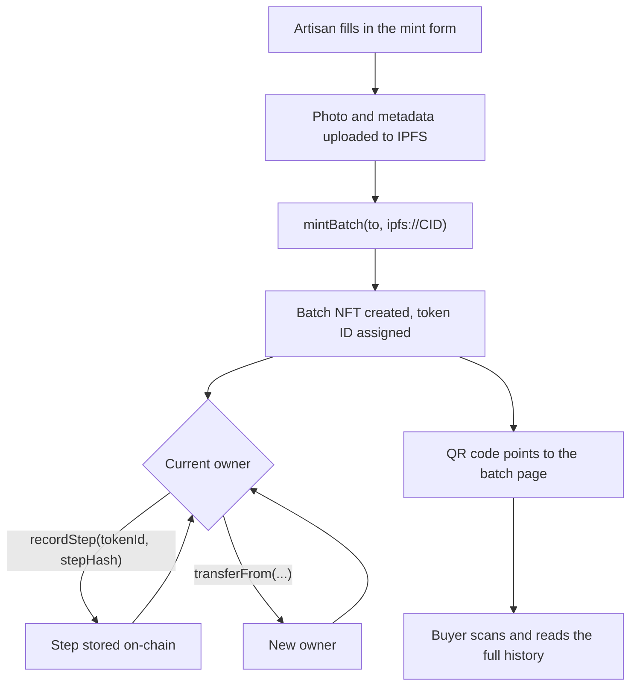
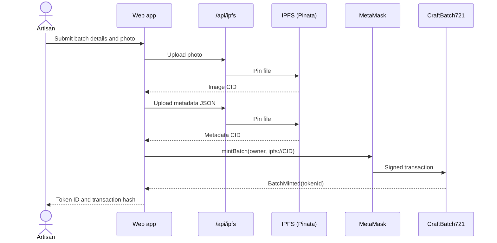
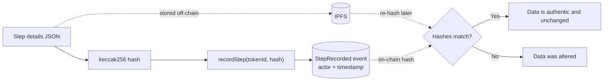
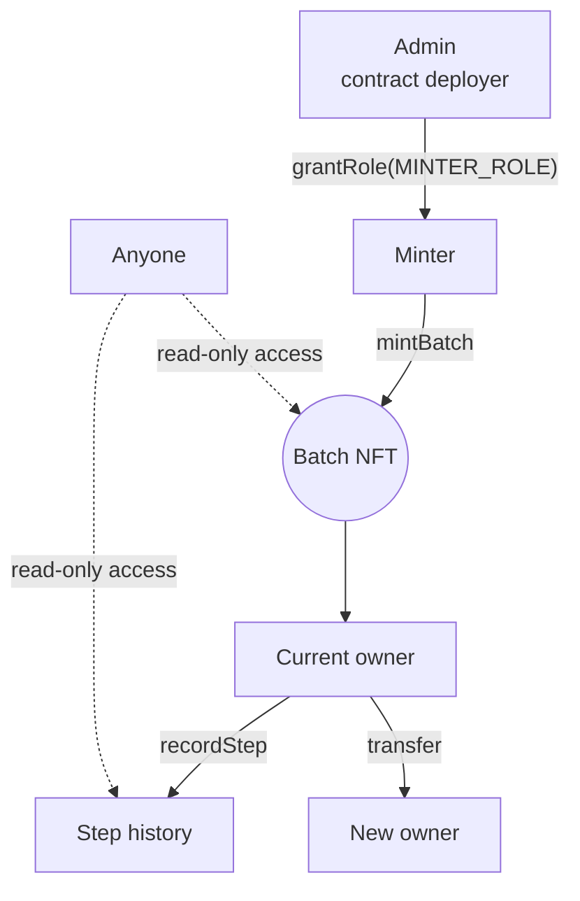

<div align="center">

# Craft-Chain

**Blockchain-based traceability for handcrafted product batches**

Every batch is an ERC-721 token on Ethereum Sepolia. Its story lives on IPFS. Anyone can verify it.


</div>

---

## Table of Contents

1. [Overview](#overview)
2. [Features](#features)
3. [How It Works](#how-it-works)
4. [Technology Stack](#technology-stack)
5. [Project Structure](#project-structure)
6. [Smart Contract](#smart-contract)
7. [Getting Started](#getting-started)
8. [Usage](#usage)
9. [Testing](#testing)
10. [Deployment](#deployment)
11. [Security](#security)
12. [Project Status](#project-status)
13. [Documentation](#documentation)
14. [License](#license)

---

## Overview

Handcrafted supply chains usually keep their records in separate spreadsheets, emails and local databases. Buyers cannot independently check where a product came from, and the people who handled it cannot prove it.

Craft-Chain gives each product batch a single public record:

- The batch is minted as an **ERC-721 token**, so it has a unique ID and one current owner.
- Descriptive data (photo, origin, material, production date) is stored on **IPFS**.
- Each journey step is recorded **on-chain** as a hash, with the actor's address and a timestamp.
- Buyers open the batch page, or scan its **QR code**, to see the whole history. Every link goes to Etherscan, so nothing has to be taken on trust.

---

## Features

| Area | Capability |
|---|---|
| Batches | Mint batches as NFTs, restricted to accounts with `MINTER_ROLE` |
| Storage | Metadata and images on IPFS through Pinata; the API key stays on the server |
| Journey | Record steps on-chain, restricted to the current owner of the batch |
| Custody | Standard ERC-721 transfers move ownership between participants |
| Verification | Public batch page with chain of custody, owner, QR code and Etherscan links |
| Discovery | Explorer with search and filters by origin, material and verification status |
| Wallet | MetaMask connection with automatic Sepolia network detection |
| Quality | 41 contract tests, TypeScript throughout, linted and formatted code |

---

## How It Works

### System architecture



### Where data lives

| On-chain (smart contract) | Off-chain (IPFS) |
|---|---|
| Token ID | Batch name and description |
| Current owner | Origin, material, production date |
| Metadata URI (link to IPFS) | Product photo |
| Step hash, actor and timestamp | |

Large and descriptive data stays on IPFS to keep gas costs low. The chain keeps only what must be tamper-proof.

### Batch lifecycle



### Minting a batch



### Verifying a step



### Roles and permissions



---

## Technology Stack

| Layer | Technology |
|---|---|
| Frontend | Next.js 14 (App Router), React 18, TypeScript, Tailwind CSS |
| Wallet and chain access | ethers.js 6, MetaMask |
| Smart contract | Solidity 0.8.24, OpenZeppelin Contracts 5 (ERC721URIStorage, ERC721Burnable, AccessControl) |
| Contract tooling | Hardhat 2, TypeChain, solidity-coverage |
| Storage | IPFS, pinned through Pinata |
| RPC provider | Alchemy |
| Hosting | Vercel (frontend), Sepolia testnet (contract) |

---

## Project Structure

```text
craft-chain/
├── blockchain/                  Smart contract project
│   ├── contracts/
│   │   └── CraftBatch721.sol    ERC-721 + AccessControl contract
│   ├── scripts/deploy.ts        Deployment script
│   ├── test/                    Contract test suite (41 tests)
│   └── hardhat.config.ts
│
├── frontend/                    Web application
│   ├── app/
│   │   ├── page.tsx             Home
│   │   ├── explorer/            Batch explorer
│   │   ├── mint/                Mint a batch
│   │   ├── record-step/         Record a journey step
│   │   ├── batch/[tokenId]/     Batch detail page
│   │   └── api/ipfs/            Server routes that talk to Pinata
│   ├── components/              UI components
│   ├── context/                 Wallet and contract providers
│   ├── hooks/                   Form validation, transaction status, batch registry
│   └── lib/                     Contract, blockchain, IPFS and error helpers
│
├── PROJECT_GUIDE.md             Step-by-step usage guide
├── LICENSE
└── README.md
```

---

## Smart Contract

`CraftBatch721` is an ERC-721 contract with role-based access control.

| Function | Access | Purpose |
|---|---|---|
| `mintBatch(to, metadataURI)` | `MINTER_ROLE` | Create a new batch NFT |
| `recordStep(tokenId, stepHash)` | Current token owner | Record a journey step |
| `getBatchSteps(tokenId)` | Public | All steps of a batch |
| `getStep(tokenId, index)` | Public | One step by index |
| `getStepCount(tokenId)` | Public | Number of recorded steps |
| `tokenURI(tokenId)` | Public | IPFS metadata link |
| `ownerOf(tokenId)` | Public | Current owner |
| `transferFrom`, `safeTransferFrom` | Owner or approved | Standard ERC-721 transfer |
| `grantRole`, `revokeRole` | Admin | Manage who can mint |

**Events**

| Event | Fields |
|---|---|
| `BatchMinted` | `tokenId` (indexed), `to` (indexed), `metadataURI` |
| `StepRecorded` | `tokenId` (indexed), `actor` (indexed), `stepHash` (indexed), `timestamp` |
| `Transfer` | Inherited from ERC-721 |

Token IDs start at 1 and increase by one. The deployer receives only `DEFAULT_ADMIN_ROLE`, so the deployer must grant `MINTER_ROLE` to every account that should mint, itself included.

**Example metadata stored on IPFS**

```json
{
  "name": "Handwoven Cotton Shawl",
  "description": "Premium handcrafted cotton product",
  "image": "ipfs://<image-cid>",
  "attributes": [
    { "trait_type": "Origin", "value": "Odisha, India" },
    { "trait_type": "Material", "value": "100% Cotton" },
    { "trait_type": "Production Date", "value": "2026-09-26" }
  ]
}
```

---

## Getting Started

### Prerequisites

- Node.js 18 or newer and npm
- MetaMask browser extension
- Alchemy account (Sepolia RPC URL)
- Pinata account (API JWT)
- Sepolia test ETH from a faucet

### 1. Clone and install

```bash
git clone https://github.com/<your-username>/craft-chain.git
cd craft-chain

cd blockchain && npm install
cd ../frontend && npm install
```

### 2. Deploy the contract

Create `blockchain/.env` from `blockchain/.env.example`:

```env
SEPOLIA_RPC_URL=https://eth-sepolia.g.alchemy.com/v2/<key>
PRIVATE_KEY=<deployer private key>
ETHERSCAN_API_KEY=<optional, for verification>
```

```bash
cd blockchain
npm run compile
npm test
npm run deploy:sepolia
```

Copy the printed contract address.

### 3. Allow an account to mint

The deployer is only the admin. Grant `MINTER_ROLE` to the wallet that will mint, with the Hardhat console or the "Write contract" tab on Etherscan:

```text
grantRole(MINTER_ROLE, <minter wallet address>)
```

### 4. Configure and run the frontend

Create `frontend/.env.local` from `frontend/.env.example`:

| Variable | Description |
|---|---|
| `NEXT_PUBLIC_CONTRACT_ADDRESS` | Address from step 2 |
| `NEXT_PUBLIC_SEPOLIA_CHAIN_ID` | `11155111` |
| `NEXT_PUBLIC_ALCHEMY_RPC_URL` | Your Sepolia RPC URL |
| `NEXT_PUBLIC_IPFS_GATEWAY` | `https://gateway.pinata.cloud/ipfs/` |
| `PINATA_JWT` | Pinata JWT. Server-only: do **not** add a `NEXT_PUBLIC_` prefix |

```bash
cd frontend
npm run dev
```

Open <http://localhost:3000> and connect MetaMask on Sepolia.

---

## Usage

| Page | URL | Wallet | What you do |
|---|---|---|---|
| Home | `/` | No | See live statistics and the newest batch |
| Explorer | `/explorer` | No | Search and filter all batches |
| Batch detail | `/batch/<id>` | No | Read the history, copy addresses, download the QR code |
| Mint | `/mint` | Yes (minter) | Create a batch |
| Record step | `/record-step` | Yes (owner) | Add a journey step |

**Artisan:** open Mint, fill in the details and photo, confirm in MetaMask, then note the token ID.

**Current owner:** open Record Step, enter the token ID, choose the step type, add a description, location and date, then confirm.

**Buyer:** scan the QR code on the product, or search the explorer, and review the owner, product details and every recorded step. Follow the Etherscan links to check them independently.

For a step-by-step walkthrough, see [PROJECT_GUIDE.md](./PROJECT_GUIDE.md).

---

## Testing

```bash
cd blockchain
npm test                  # run the contract tests
npm run test:coverage     # coverage report
```

```bash
cd frontend
npm run type-check        # TypeScript
npm run lint              # ESLint
npm run build             # production build
```

---

## Deployment

**Contract:** `npm run deploy:sepolia` from `blockchain/`.

**Frontend (Vercel):**

1. Import the repository and set **Root Directory** to `frontend`. Leave the build settings at their defaults.
2. Add the environment variables from [Getting Started](#4-configure-and-run-the-frontend).
3. Deploy. The `/api/ipfs/*` routes run as serverless functions, so no separate backend is needed.

Vercel's free plan limits request bodies to about 4.5 MB, so photos between 4.5 MB and 5 MB will fail to upload there.

---

## Security

- Only accounts with `MINTER_ROLE` can mint, and only the current owner can record steps.
- Transactions are signed in MetaMask. The app never handles a user's private key.
- The Pinata key is read only by server routes. Anything with a `NEXT_PUBLIC_` prefix is visible to every visitor, so secrets must never use it.
- `.env` files are git-ignored. Use a dedicated test wallet for deployment.
- All IPFS data is public. Store only product information, never personal details.
- This project targets a testnet and has not been audited for use with real value.

---

## Project Status

| Component | Status |
|---|---|
| Smart contract | Implemented, deployed on Sepolia, 41 tests passing |
| Frontend | Home, explorer, mint, record step and batch pages implemented |
| IPFS integration | Implemented through server-side upload routes |
| Production build | Passing |

**Known limitations**

- The batch page shows each step's on-chain data (actor, time, hash). The step's description and location are saved to IPFS but not yet linked back on-chain, so they are not displayed.
- The explorer checks token IDs one after another, up to 120. A very large registry would need an event-based index.
- There is no in-app page for transferring ownership. Transfers use standard ERC-721 tools.

**Roadmap**

- Link step details from IPFS to the batch timeline
- Ownership transfer page
- Event-based indexing for larger registries
- Batch analytics and multi-chain support

---

## Documentation

- [PROJECT_GUIDE.md](./PROJECT_GUIDE.md): usage and troubleshooting guide

---

## License

Released under the MIT License. See [LICENSE](./LICENSE).

---

## References

- [OpenZeppelin ERC-721](https://docs.openzeppelin.com/contracts/5.x/erc721)
- [Hardhat](https://hardhat.org/docs)
- [ethers.js](https://docs.ethers.org/v6/)
- [IPFS](https://docs.ipfs.tech/)
- [MetaMask](https://docs.metamask.io/)
